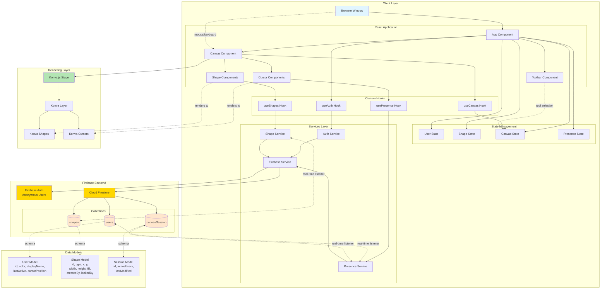

# CollabCanvas Architecture

## System Architecture Diagram



---

## Architecture Overview

### **Layer 1: Client Application (React + TypeScript)**

The client application is built with React 18+ and TypeScript, following a feature-based architecture.

**Component Hierarchy:**
- `App Component` - Root component, manages global state and routing
- `Canvas Component` - Main workspace, handles pan/zoom and user interactions
- `Toolbar Component` - Fixed UI for tool selection (Draw Rect button)
- `Shape Components` - Render individual shapes on canvas
- `Cursor Components` - Render multiplayer cursors with labels

**State Management:**
- `UserState` - Current user data (id, color, auth status)
- `ShapeState` - All shapes on canvas (synced from Firestore)
- `CanvasState` - Canvas view state (zoom level, pan position, active tool)
- `PresenceState` - Active users and their cursor positions

**Custom Hooks:**
- `useAuth` - Anonymous authentication, user creation
- `usePresence` - Track and sync user presence/cursors
- `useShapes` - CRUD operations for shapes, real-time sync
- `useCanvas` - Canvas navigation, boundary enforcement

---

### **Layer 2: Services Layer**

Abstraction layer for Firebase operations, following single responsibility principle.

**FirebaseService:**
- Initialize Firebase app
- Export Firestore and Auth instances
- Centralized configuration

**AuthService:**
- Anonymous user sign-in
- Generate random user color
- Create user document in Firestore
- Handle auth state changes

**PresenceService:**
- Track user online/offline status
- Sync cursor position (debounced ≤50ms)
- Update `lastActive` timestamp (heartbeat)
- Clean up on disconnect (onDisconnect handlers)
- Listen to active users collection

**ShapeService:**
- Create shapes (write to Firestore)
- Update shapes (position, lock status)
- Delete shapes (future feature)
- Real-time listener for shapes collection
- Lock/unlock shapes (atomic operations)
- Handle lock cleanup on disconnect

---

### **Layer 3: Rendering Layer (Konva.js)**

High-performance canvas rendering using Konva.js and react-konva.

**Konva Stage:**
- 10,000 x 10,000px canvas
- Manages viewport transformations (pan/zoom)
- Event handling for mouse interactions

**Konva Layer:**
- Container for all canvas objects
- Optimized batch rendering

**Konva Shapes:**
- Rectangle primitives
- Dynamic properties from ShapeState
- Draggable with boundary constraints

**Konva Cursors:**
- Custom cursor graphics (pointer + label)
- Positioned based on PresenceState
- Color-coded per user

---

### **Layer 4: Firebase Backend**

**Firebase Authentication:**
- Anonymous sign-in enabled
- No email/password required
- Automatic user ID generation

**Cloud Firestore:**
- Real-time NoSQL database
- Three main collections:

**Collections Structure:**

1. **`users` Collection:**
```typescript
{
  userId: string (document ID)
  color: string (hex color)
  displayName: string (user ID)
  lastActive: timestamp
  cursorPosition: { x: number, y: number }
}
```

2. **`shapes` Collection:**
```typescript
{
  shapeId: string (document ID)
  type: 'rectangle'
  x: number
  y: number
  width: number
  height: number
  fill: string (hex color)
  createdBy: string (user ID)
  createdAt: timestamp
  lockedBy?: string (user ID)
  lockedAt?: timestamp
}
```

3. **`canvasSession` Collection:**
```typescript
{
  sessionId: 'default' (document ID)
  activeUsers: string[] (array of user IDs)
  lastModified: timestamp
}
```

---

## Data Flow Diagrams

### **User Authentication Flow**
```
User Opens App
    ↓
useAuth Hook Initializes
    ↓
AuthService.signInAnonymously()
    ↓
Firebase Auth Creates Anonymous User
    ↓
AuthService.createUserDocument()
    ↓
Generate Random Color
    ↓
Write to Firestore users/{userId}
    ↓
UserState Updated
    ↓
App Renders with User Context
```

### **Cursor Sync Flow**
```
User Moves Mouse on Canvas
    ↓
Canvas Component Captures mousemove
    ↓
Convert Screen → Canvas Coordinates
    ↓
Debounce (≤50ms)
    ↓
PresenceService.updateCursor(x, y)
    ↓
Update Firestore users/{userId}.cursorPosition
    ↓
Real-time Listener Triggers on Other Clients
    ↓
PresenceState Updated
    ↓
Cursor Components Re-render
```

### **Shape Creation Flow**
```
User Clicks "Draw Rect" Button
    ↓
CanvasState.activeTool = 'rectangle'
    ↓
User Press/Drag/Release on Canvas
    ↓
Canvas Component Tracks Interaction
    ↓
During Drag: Render Local Preview
    ↓
During Drag: Sync to Firestore (in-progress)
    ↓
On Release: ShapeService.createShape()
    ↓
Enforce Boundary Constraints
    ↓
Write to Firestore shapes/{shapeId}
    ↓
Real-time Listener Triggers on All Clients
    ↓
ShapeState Updated
    ↓
Shape Components Render New Shape
```

### **Shape Drag Flow**
```
User Mousedown on Shape
    ↓
Check if Shape Locked
    ↓
If Locked by Another User: Prevent Interaction
    ↓
If Unlocked: Acquire Lock
    ↓
ShapeService.lockShape(shapeId, userId)
    ↓
Update Firestore shapes/{shapeId}.lockedBy
    ↓
Render 🔒 Lock Indicator
    ↓
User Drags Shape
    ↓
Track Movement, Enforce Boundaries
    ↓
Update Shape Position (optimistic local)
    ↓
Sync to Firestore (real-time)
    ↓
User Releases Mouse
    ↓
ShapeService.unlockShape(shapeId)
    ↓
Clear Firestore shapes/{shapeId}.lockedBy
    ↓
Remove Lock Indicator
```

### **Disconnect Handling Flow**
```
User Closes Browser/Loses Connection
    ↓
Firebase onDisconnect Handler Triggers
    ↓
PresenceService Cleanup:
    - Remove user from activeUsers[]
    - Delete user document
    ↓
ShapeService Cleanup:
    - Find shapes with lockedBy = userId
    - Clear lockedBy field
    - Cancel in-progress operations
    ↓
Other Clients Receive Updates
    ↓
Remove Cursor from PresenceState
    ↓
Release Shape Locks
    ↓
Re-enable Interactions
```

---

## Technology Stack Details

### **Frontend**
- **React 18+** - Component-based UI
- **TypeScript** - Type safety and developer experience
- **Konva.js** - High-performance canvas rendering
- **react-konva** - React bindings for Konva
- **Vite** - Fast build tool and dev server

### **Backend**
- **Firebase Authentication** - Anonymous user management
- **Cloud Firestore** - Real-time NoSQL database
- **Firebase Hosting** - Static site deployment

### **Development Tools**
- **ESLint** - Code linting
- **Prettier** - Code formatting
- **TypeScript Compiler** - Type checking

---

## Performance Considerations

### **Rendering Optimization**
- Use `React.memo` for Shape and Cursor components
- Implement `useCallback` for event handlers
- Debounce cursor position updates (≤50ms)
- Batch Firestore writes where possible
- Optimize Konva layer rendering (avoid unnecessary redraws)

### **Network Optimization**
- Throttle cursor position syncs (60 FPS max)
- Use Firestore transaction for lock acquisition
- Implement optimistic updates for local user
- Cache user colors locally
- Minimize payload size in Firestore documents

### **Scalability**
- Firestore auto-scales for concurrent users
- Client-side rendering reduces server load
- Real-time listeners are efficient for <100 concurrent users
- Consider Firestore indexes for large shape collections

---

## Security Considerations

### **Firestore Security Rules**
```javascript
rules_version = '2';
service cloud.firestore {
  match /databases/{database}/documents {
    // Users can read all documents
    match /{document=**} {
      allow read: if request.auth != null;
    }
    
    // Users can only write their own user document
    match /users/{userId} {
      allow write: if request.auth != null && request.auth.uid == userId;
    }
    
    // Any authenticated user can create shapes
    match /shapes/{shapeId} {
      allow create: if request.auth != null;
      allow update, delete: if request.auth != null;
    }
    
    // Session document accessible to all authenticated users
    match /canvasSession/{sessionId} {
      allow read, write: if request.auth != null;
    }
  }
}
```

### **Client-Side Validation**
- Validate shape boundaries before Firestore write
- Validate lock ownership before updates
- Sanitize user input (future features)

---

## File Structure

```
collabcanvas/
├── _docs/                 # Project documentation
│   ├── PRD.md
│   ├── TASK_LIST.md
│   ├── ARCHITECTURE.md
│   └── react-architecture-guide.md
├── src/
│   ├── components/
│   │   ├── Canvas.tsx
│   │   ├── Toolbar.tsx
│   │   ├── Shape.tsx
│   │   ├── Cursor.tsx
│   │   └── LockIndicator.tsx
│   ├── hooks/
│   │   ├── useAuth.ts
│   │   ├── usePresence.ts
│   │   ├── useShapes.ts
│   │   └── useCanvas.ts
│   ├── services/
│   │   ├── firebase.ts
│   │   ├── authService.ts
│   │   ├── presenceService.ts
│   │   └── shapeService.ts
│   ├── types/
│   │   ├── User.ts
│   │   ├── Shape.ts
│   │   └── Canvas.ts
│   ├── utils/
│   │   ├── colors.ts
│   │   ├── boundaries.ts
│   │   └── debounce.ts
│   ├── App.tsx
│   └── main.tsx
├── .env
├── package.json
├── tsconfig.json
├── vite.config.ts
└── README.md
```

---

## MVP Success Criteria Mapping

| Requirement | Architecture Component |
|-------------|----------------------|
| Canvas 10,000x10,000px | Konva Stage configuration |
| Pan/Zoom | Canvas Component + useCanvas hook |
| Boundary enforcement | Boundary utils + Canvas constraints |
| Anonymous auth | Firebase Auth + AuthService |
| User colors | AuthService color generation |
| Cursor sync <50ms | PresenceService + debounced updates |
| Shape creation | ShapeService + Canvas interactions |
| Shape persistence | Firestore shapes collection |
| Object locking | ShapeService lock/unlock methods |
| Lock indicator | LockIndicator component |
| Disconnect handling | Firebase onDisconnect + cleanup |
| Real-time sync | Firestore real-time listeners |
| 60 FPS performance | Konva optimization + React.memo |

---

## Development Guidelines

### **Component Development**
- Follow React architecture guide principles
- Use functional components with hooks exclusively
- Implement TypeScript interfaces for all props
- Use `React.memo` for performance optimization
- Keep components under 200 lines
- Single responsibility per component

### **State Management**
- Keep state as close to usage as possible
- Lift state only when necessary for sharing
- Use custom hooks for complex state logic
- Avoid prop drilling (max 2-3 levels)

### **Performance**
- Profile components during development
- Test with 500+ shapes regularly
- Monitor network payload sizes
- Measure FPS during interactions
- Optimize before adding features

### **Testing Strategy**
- Test with multiple browser windows
- Simulate network disconnections
- Test boundary edge cases
- Verify lock race conditions
- Load test with multiple concurrent users

---

## Common Pitfalls & Solutions

### **Problem: Cursor lag**
**Solution:** Ensure cursor updates are debounced to ≤50ms and use optimistic local rendering

### **Problem: Shape sync conflicts**
**Solution:** Implement proper lock acquisition with Firestore transactions

### **Problem: Canvas performance degradation**
**Solution:** Use Konva layer optimization and React.memo for shape components

### **Problem: Stale locks after disconnect**
**Solution:** Implement Firebase onDisconnect handlers for automatic cleanup

### **Problem: Boundary calculation errors**
**Solution:** Test thoroughly with edge cases and use helper utilities for calculations

---

## Future Architecture Considerations

While out of scope for MVP, the architecture should accommodate:

- **AI Agent Integration:** Service layer can expose canvas API functions for AI function calling
- **Multiple Shape Types:** Shape model extensible with `type` discriminator
- **Advanced Selections:** Selection state can be added to CanvasState
- **Undo/Redo:** History service with command pattern
- **Permissions:** User roles can be added to User model
- **Export:** Export service can serialize canvas state

---

## Deployment Architecture

```
Developer Machine
    ↓ (git push)
GitHub Repository
    ↓ (firebase deploy)
Firebase Hosting (CDN)
    ↓ (serves)
Static Assets (HTML, JS, CSS)
    ↓ (connects to)
Firebase Services
    ├── Firebase Auth
    └── Cloud Firestore
```

**Deployment Steps:**
1. Build production bundle: `npm run build`
2. Initialize Firebase: `firebase init`
3. Deploy to hosting: `firebase deploy`
4. Verify production URL
5. Test with multiple users

---

## Monitoring & Observability

### **Metrics to Track**
- Firestore read/write operations
- Authentication success rate
- Average cursor sync latency
- Canvas rendering FPS
- User session duration
- Concurrent user count

### **Error Tracking**
- Log Firestore connection errors
- Track authentication failures
- Monitor lock acquisition conflicts
- Record boundary constraint violations

---

## Glossary

- **Canvas Space:** 10,000x10,000px coordinate system with (0,0) at center
- **Viewport:** Visible portion of canvas rendered in browser window
- **Lock:** Exclusive write access to a shape during manipulation
- **Presence:** Real-time awareness of active users and their cursors
- **Sync:** Propagating state changes across all connected clients
- **Debounce:** Limiting function execution frequency (e.g., cursor updates)
- **Optimistic Update:** Updating local UI before server confirmation

---

This architecture provides a solid foundation for the CollabCanvas MVP while remaining extensible for future enhancements.